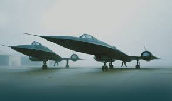

# Blackbird-SR71

## This website gives the Information about BlackBird-SR71
### The iconic SR-71 Blackbird spy plane is known for being the official record holder for the fastest jet-powered, piloted aircraft of all time. 
### The Lockheed SR-71 "Blackbird" is a long-range, high-altitude, Mach 3+ strategic reconnaissance aircraft developed and manufactured by the American aerospace company Lockheed Corporation. It was operated by both the United States Air Force and NASA.
